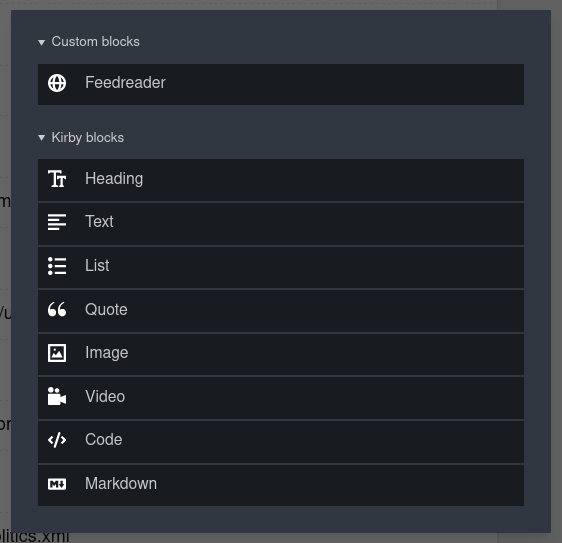
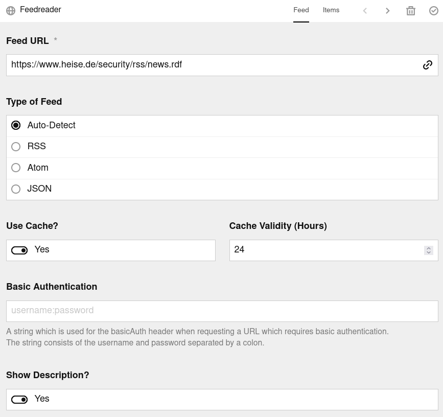
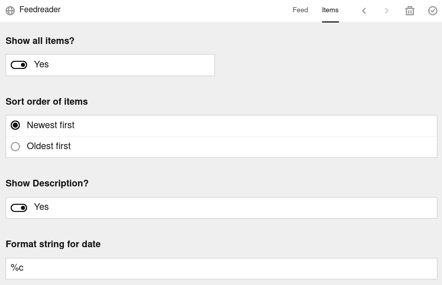
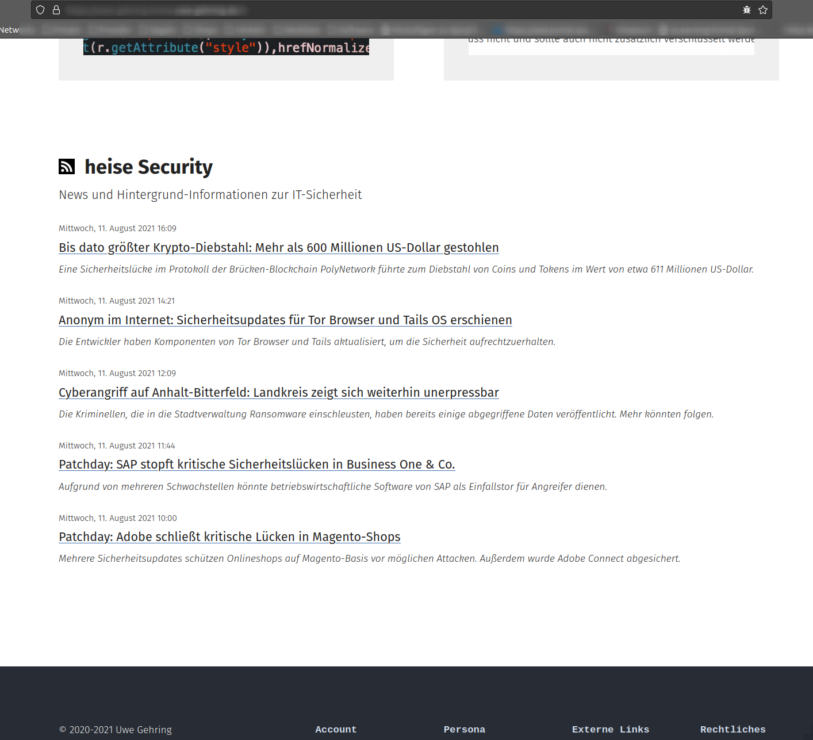

# Documentation

## Contents

* [Extended Usage](#extended-usage)
* [Caching](#caching)
* [Debugging](#debugging)
* [Reference](#reference)

## Extended Usage

The plugin contains the blocks blueprint [`feedreader.yml`](../blueprints/blocks/feedreader.yml) and a the corresponding snippet [`feedreader.php`](../snippets/blocks/feedreader.php) to work with Kirby's panel.
### Blocks Blueprint

If you want to use the blocks blueprint, you need to include it in the `return` statement of your `config.php`, e.g. like this:

```yml
  'blocks' => [
    'fieldsets' => [
      'custom' =>[
        'label' => 'Custom blocks',
        'type' => 'group',
        'fieldsets' => [
          'feedreader'
        ]
      ],
      'kirby' => [
        'label' => 'Kirby blocks',
        'type' => 'group',
        'fieldsets' => [
          'heading',
          'text',
          'list',
          'quote',
          'image',
          'video',
          'code',
          'markdown'
        ]
      ]
    ]
  ],
```

Then, you can add the custom "Feedreader" block in a blocks field from the panel:



After insertion, you have to provide at least the **Feed URL**. All other fields have a reasonable default value, which will be explained next.

The input form is divided into two tabs, where the **Feed** tab is for the options which affect the whole feed, and the **Items** tab for the options which affect the items of the feed.

#### Feed options



The **Type of Feed** will be autodetected by its header. However, some feeds type is not autodetectable, then you can give the type here.

If **Use Cache?** is set to "Yes" this feed will use the plugins cache if caching is enabled globally in the plugin options. See [Caching](#caching) for more details how the cache is implemented in this plugin.

The **Cache Validity (Hours)** is the amount of time the cached feed is treated valid. After this time the feed is definitely fetched from the source. The default is 24 hours.

If the feed needs authentication, the HTTP **Basic Authentication** string can be provided. This string consists of the username and password separated by a colon.

If you do not want to show the feeds description, set **Show Description?** to "No" on this tab.

#### Items options



You can choose whether to **Show all items?** or only a certain number. The input field where you can set this number appears if you set this value to "No".

The default **Sort order of items** is newest first, but you can show the items oldest first if you like.

Some feeds do not provide a rather short article description (with the full article behind the linked URL of the item), but the full article with formatting and eventually even images. If you do not want to show this kind of description, set **Show Description?** to "No" on the item level. The full article will still be available by clicking on its provided link.

You can chooose how to format the date by providing a `strftime` compatible **Format string for date**. The default is `%c`, which will show a localized combined date and time stamp like "Mo 26 Jul 2021 15:55:00 CEST" in German.

### Blocks Snippet

The content of the block will be rendered by means of the [`feedreader`](../snippets/blocks/feedreader.php) snippet. You can take this as an example how to deal with the different options and methods. All methods will be described in the [Reference](#reference) section.

### Example Look

In conjunction with a proper styling the RSS feed used in the example above would be shown on the web page as this:


## Caching

The rationale to cache feeds is that is not necessary to fetch the feed from its source in case it did not change since the last retrieval. This implies that a procedure is needed to efficiently detect if the feeds source will differ from what is already stored locally.

If a feed is requested for the very first time, it will be saved to the cache, i.e. the HTTP header and the HTTP body (the "content") will be stored in the cache file. The validity of the cache file is given by the `cacheValidity` value in the `feedOptions` array and defaults to 24 hours.

If the feed is accessed again in this time period, the stored header in the cache file will be inspected for either the `ETag` or the `Last-Modified` header. If one or both of these values are present, the request will be formed with the header `If-None-Match` (with the `ETag` value) and/or `If-Modified-Since` (with the `Last-Modified` value) which is called a "conditional request". The feeds source server will take these headers into account and checks if the requested URL would be delivered with the same values, which would indicate that the source on the server has not been modified since the last request where these values come from. In this case, the server responds with a HTTP 304 ("Not Modified") message header and does not send the body of the message.

As a result, the feeds content from the cached file will be shown.

If both header values mentioned above are not provided by the feeds source, the feed will always be updated from the server, since no conditional request can be made and the answer from the server will always contain the full message body.

If the cache validity time has elapsed by the time of the subsequent request, the feed is also fetched from its source regardless of the header values.

Therefore, it makes sense to set the cache validity to a high value, especially for feeds which are not updated frequently.

## Debugging

It shouldn't be noted as a problem if a feed can not be retrieved correctly due to the various formats of a feed which even do not correspond to the recommended standards. Thus, an error might appear and if it is not obvious how to mitigate, it is possible to dump out the `FeedReader` object and its content (see [Errors](../README.md#errors) in the README for an overview how to do this) by means of the `debug()` method.

Note that first it should be checked if the `FeedReader` object contains an error which could be as simple as the provided URL is not correct or needs basic authentication or anything else.

Used without parameters, the `debug()` method returns an array which contains some properties of the `FeedReader` object and the complete `Feed` object, the latter will be either a `RSSFeed`, a `AtomFeed`, or a `JSONFeed` object, depending on the given or detected feed type.

The output of `debug()` however can be controlled by various flags combined by the "Bitwise Or" operator (`|`) depending on your needs.

### `DEBUG_NOXDB_LIMIT`

If you have **Xdebug** installed and using the `var_dump` function from PHP, you will note that Xdebug have replaced this function with its own version, which also places certain limits on the amount of array elements/object properties, maximum depth and string lengths which will be shown (see the [Xdebug documentation](https://xdebug.org/docs/develop#display)).

The `debug()` method will by default change these limits again. The string length will be reduced from 512 characters to 256, and the nested levels of array elements and object properties will be increased from 3 to 5.

You can disable any limitation imposed by Xdebug by giving the `DEBUG_NOXDB_LIMIT` flag to the debug method, e.g.:

```php
if ($kirby->option('debug')) { var_dump($feed->debug($feed::DEBUG_NOXDB_LIMIT)); }
```

### `DEBUG_ALL`

This flag is a shortcut for setting all of the following flags, i.e., with the exception of `DEBUG_NOXDB_LIMIT`. If you would like to get the maximum out of the `debug()` method, your PHP code would read:

```php
if ($kirby->option('debug')) { var_dump($feed->debug($feed::DEBUG_NOXDB_LIMIT | $feed::DEBUG_ALL)); }
```

### `DEBUG_FEEDREADER`

This flag will show the relevant properties of the `FeedReader` object, i.e., the `url`,, `urlOptions`, `feedOptions`, `fromCache`, and `errors`. It is set by default.

### `DEBUG_FEED`

This flag will show the properties of either the `RSSFeed`, `AtomFeed`, or `JSONFeed` object, depending on the given or detected feed type. It is set by default.

### `DEBUG_REQUEST`

This flag will show the full request as it is returned by the `Kirby/Http/Remote::request` method from the feeds server. If this flag is given, the following two flags will be omitted since the header and the body of the request are already contained in the request.

### `DEBUG_HEADER`

This flag will show the HTTP header from the request either from the feeds server or from the cache.

### `DEBUG_CONTENT`

This flag will show the HTTP body from the request either from the feeds server or from the cache.

### `DEBUG_RESPONSE`

This flag will show the parsed content (HTTP body) which is either parsed by the `Kirby\Toolkit\Xml::parse` method in case of RSS and Atom feed types, or by PHP's `json_decode` in case of JSON feed types.

## Reference

### FeedReader::articles

Returns the list of feed items as array of `Article` objects (see below).

```php
public articles(int $count = null, string $order = 'standard'): array
```

`$count`: Number of items to return. Possible values: Any positive integer. Default: `null` (all items).<br/>
`$order`: The order of the items. Possible values: `standard` (newest first) or `reverse` (oldest first). Default: `standard`.

### FeedReader::builddate

Returns the build date of the feed as a formatted string.

```php
public builddate(string $format = '%c'): string
```

`$format`: A [`strftime`](https://www.php.net/manual/de/function.strftime.php) compatible format string. Default: `%c` (combined date and time stamp).

### FeedReader::debug

Returns variables and objects of the `FeedReader` object as array.

```php
public debug(int $flags = self::DEBUG_FEEDREADER | self::DEBUG_FEED): array
```

 `$flags`: A bitmask of DEBUG_NOXDB_LIMIT, DEBUG_ALL, DEBUG_FEEDREADER, DEBUG_FEED, DEBUG_REQUEST, DEBUG_HEADER, DEBUG_CONTENT, DEBUG_RESPONSE. See [Debugging](#debugging) for a more detailed description of these constants.

### FeedReader::description

Returns the description of the feed as a string.

```php
public description(): string
```

### FeedReader::error

Returns the errors during initialization as array.

```php
public error(): array
```

### FeedReader::fromCache

Indicates if the feed is coming from the cache or not as a bool value.

```php
public fromCache(): bool
```

### FeedReader::language

Returns the language of the feed as a string.

```php
public language(): string
```

### FeedReader::link

Returns the URL of the feed as given in the feed itself as a string.

```php
public link(): string
```

### FeedReader::title

Returns the title of the feed as a string.

```php
public title(): string
```

### Article::description

Returns the description of a feed item as string.

```php
public description(): string
```

### Article::guid

Returns the short URL of a feed item as a string.

```php
public guid(): string
```

### Article::image

Returns the URL to an image of a feed item as a string.

```php
public image(): string
```

### Article::link

Returns the URL to a feed item as a string.

```php
public link(): string
```

### Article::pubdate

Returns the publication date of a feed item as a formatted string.

```php
public pubdate(string $format = '%c'): string
```

`$format`: A [`strftime`](https://www.php.net/manual/de/function.strftime.php) compatible format string. Default: `%c` (combined date and time stamp).

### Article::title

Returns the title of a feed item as a string.

```php
public title(): string
```
